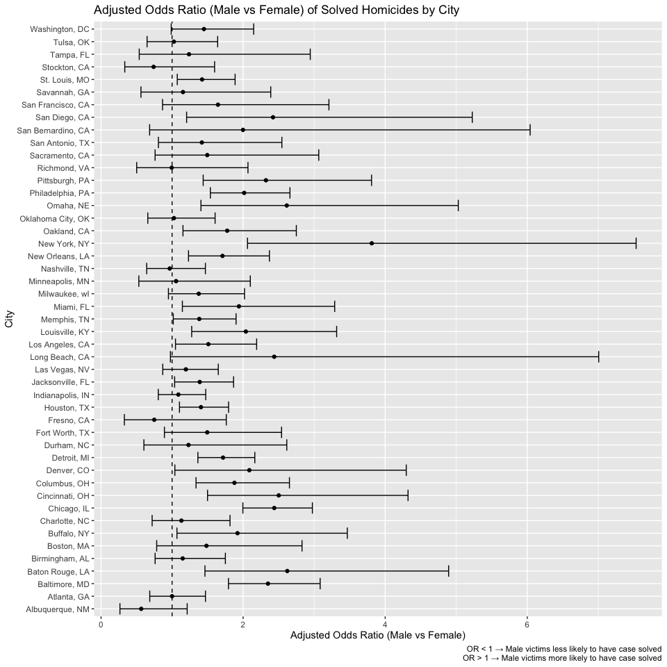

## Question 1

    homicide = 
     read_csv("homicide-data.csv", na = c("NA",".", "")) |> 
      janitor :: clean_names() 

    ## Rows: 52179 Columns: 12
    ## ── Column specification ─────────────────────────────────────────────────────────────────────────────────────
    ## Delimiter: ","
    ## chr (9): uid, victim_last, victim_first, victim_race, victim_age, victim_sex, city, state, disposition
    ## dbl (3): reported_date, lat, lon
    ## 
    ## ℹ Use `spec()` to retrieve the full column specification for this data.
    ## ℹ Specify the column types or set `show_col_types = FALSE` to quiet this message.

    homicide

    ## # A tibble: 52,179 × 12
    ##    uid       reported_date victim_last victim_first victim_race victim_age victim_sex city  state   lat   lon
    ##    <chr>             <dbl> <chr>       <chr>        <chr>       <chr>      <chr>      <chr> <chr> <dbl> <dbl>
    ##  1 Alb-0000…      20100504 GARCIA      JUAN         Hispanic    78         Male       Albu… NM     35.1 -107.
    ##  2 Alb-0000…      20100216 MONTOYA     CAMERON      Hispanic    17         Male       Albu… NM     35.1 -107.
    ##  3 Alb-0000…      20100601 SATTERFIELD VIVIANA      White       15         Female     Albu… NM     35.1 -107.
    ##  4 Alb-0000…      20100101 MENDIOLA    CARLOS       Hispanic    32         Male       Albu… NM     35.1 -107.
    ##  5 Alb-0000…      20100102 MULA        VIVIAN       White       72         Female     Albu… NM     35.1 -107.
    ##  6 Alb-0000…      20100126 BOOK        GERALDINE    White       91         Female     Albu… NM     35.2 -107.
    ##  7 Alb-0000…      20100127 MALDONADO   DAVID        Hispanic    52         Male       Albu… NM     35.1 -107.
    ##  8 Alb-0000…      20100127 MALDONADO   CONNIE       Hispanic    52         Female     Albu… NM     35.1 -107.
    ##  9 Alb-0000…      20100130 MARTIN-LEY… GUSTAVO      White       56         Male       Albu… NM     35.1 -107.
    ## 10 Alb-0000…      20100210 HERRERA     ISRAEL       Hispanic    43         Male       Albu… NM     35.1 -107.
    ## # ℹ 52,169 more rows
    ## # ℹ 1 more variable: disposition <chr>

    homicide_city_state = 
      homicide |> 
      mutate(
        city_state = paste(city, state, sep = ", ")
      ) |> 
      mutate(
        unsolved = disposition %in% c("Closed without arrest", "Open/No arrest")
      ) |> 
      mutate(unsolved_bin = ifelse(unsolved == TRUE, 1, 0)) |> 
      filter(!(city_state %in% c("Dallas, TX",
                                 "Phoenix, AZ",
                                 "Kansas City, MO",
                                 "Tulsa, AL"))) |> 
      filter(victim_race %in% c("White", "Black")) |> 
      mutate(victim_age = as.numeric(victim_age)) 

    ## Warning: There was 1 warning in `mutate()`.
    ## ℹ In argument: `victim_age = as.numeric(victim_age)`.
    ## Caused by warning:
    ## ! NAs introduced by coercion

    homicide_city_state

    ## # A tibble: 39,693 × 15
    ##    uid       reported_date victim_last victim_first victim_race victim_age victim_sex city  state   lat   lon
    ##    <chr>             <dbl> <chr>       <chr>        <chr>            <dbl> <chr>      <chr> <chr> <dbl> <dbl>
    ##  1 Alb-0000…      20100601 SATTERFIELD VIVIANA      White               15 Female     Albu… NM     35.1 -107.
    ##  2 Alb-0000…      20100102 MULA        VIVIAN       White               72 Female     Albu… NM     35.1 -107.
    ##  3 Alb-0000…      20100126 BOOK        GERALDINE    White               91 Female     Albu… NM     35.2 -107.
    ##  4 Alb-0000…      20100130 MARTIN-LEY… GUSTAVO      White               56 Male       Albu… NM     35.1 -107.
    ##  5 Alb-0000…      20100218 LUJAN       KEVIN        White               NA Male       Albu… NM     35.1 -107.
    ##  6 Alb-0000…      20100308 GRAY        STEFANIA     White               43 Female     Albu… NM     35.1 -107.
    ##  7 Alb-0000…      20100323 DAVID       LARRY        White               52 Male       Albu… NM     NA     NA 
    ##  8 Alb-0000…      20100402 BRITO       ELIZABETH    White               22 Female     Albu… NM     35.1 -107.
    ##  9 Alb-0000…      20100423 KING        TEVION       Black               15 Male       Albu… NM     35.1 -107.
    ## 10 Alb-0000…      20100423 BOYKIN      CEDRIC       Black               25 Male       Albu… NM     35.1 -107.
    ## # ℹ 39,683 more rows
    ## # ℹ 4 more variables: disposition <chr>, city_state <chr>, unsolved <lgl>, unsolved_bin <dbl>

    baltimore = homicide_city_state |> 
      filter(city_state == "Baltimore, MD")

    fit = glm(
      unsolved_bin ~ victim_age + victim_sex + victim_race, data = baltimore,  family = binomial(link = "logit")
    )
    tidy_fit = broom::tidy(fit, conf.int = TRUE, exponentiate = TRUE)

    tidy_fit

    ## # A tibble: 4 × 7
    ##   term             estimate std.error statistic  p.value conf.low conf.high
    ##   <chr>               <dbl>     <dbl>     <dbl>    <dbl>    <dbl>     <dbl>
    ## 1 (Intercept)         0.733   0.171       -1.81 7.04e- 2    0.523     1.02 
    ## 2 victim_age          1.01    0.00332      2.02 4.30e- 2    1.00      1.01 
    ## 3 victim_sexMale      2.35    0.138        6.18 6.26e-10    1.79      3.08 
    ## 4 victim_raceWhite    0.431   0.175       -4.82 1.45e- 6    0.305     0.606

    tidy_fit |> 
      filter(term == "victim_sexMale")

    ## # A tibble: 1 × 7
    ##   term           estimate std.error statistic  p.value conf.low conf.high
    ##   <chr>             <dbl>     <dbl>     <dbl>    <dbl>    <dbl>     <dbl>
    ## 1 victim_sexMale     2.35     0.138      6.18 6.26e-10     1.79      3.08

    city_models = homicide_city_state |> 
      group_by(city_state) |> 
      nest() |> 
      mutate(
        fit = map(data, ~ glm(
          unsolved_bin ~ victim_age + victim_sex + victim_race,
          data = .x,
          family = binomial(link = "logit")
        )),
        tidy_fit = map(fit, ~ broom::tidy(.x, conf.int = TRUE, exponentiate = TRUE))
      ) |> 
      select(city_state, tidy_fit) |> 
      unnest(tidy_fit) |> 
      filter(term == "victim_sexMale")  

    ## Warning: There were 43 warnings in `mutate()`.
    ## The first warning was:
    ## ℹ In argument: `tidy_fit = map(fit, ~broom::tidy(.x, conf.int = TRUE, exponentiate = TRUE))`.
    ## ℹ In group 1: `city_state = "Albuquerque, NM"`.
    ## Caused by warning:
    ## ! glm.fit: fitted probabilities numerically 0 or 1 occurred
    ## ℹ Run `dplyr::last_dplyr_warnings()` to see the 42 remaining warnings.

    city_models

    ## # A tibble: 47 × 8
    ## # Groups:   city_state [47]
    ##    city_state      term           estimate std.error statistic   p.value conf.low conf.high
    ##    <chr>           <chr>             <dbl>     <dbl>     <dbl>     <dbl>    <dbl>     <dbl>
    ##  1 Albuquerque, NM victim_sexMale    0.566     0.385 -1.48     1.39 e- 1    0.266      1.21
    ##  2 Atlanta, GA     victim_sexMale    1.000     0.194 -0.000397 1.000e+ 0    0.686      1.47
    ##  3 Baltimore, MD   victim_sexMale    2.35      0.138  6.18     6.26 e-10    1.79       3.08
    ##  4 Baton Rouge, LA victim_sexMale    2.62      0.306  3.15     1.65 e- 3    1.46       4.89
    ##  5 Birmingham, AL  victim_sexMale    1.15      0.212  0.657    5.11 e- 1    0.761      1.75
    ##  6 Boston, MA      victim_sexMale    1.48      0.326  1.21     2.26 e- 1    0.783      2.83
    ##  7 Buffalo, NY     victim_sexMale    1.92      0.299  2.18     2.90 e- 2    1.07       3.47
    ##  8 Charlotte, NC   victim_sexMale    1.13      0.236  0.524    6.00 e- 1    0.719      1.82
    ##  9 Chicago, IL     victim_sexMale    2.44      0.102  8.77     1.86 e-18    2.00       2.98
    ## 10 Cincinnati, OH  victim_sexMale    2.50      0.269  3.41     6.49 e- 4    1.50       4.32
    ## # ℹ 37 more rows

    city_models_plot = ggplot(city_models |> 
             mutate(city_state = fct_reorder(city_state, estimate)),
           aes(x = city_state, y = estimate)) +
      geom_point() +
      geom_errorbar(aes(ymin = conf.low, ymax = conf.high)) +
      geom_hline(yintercept = 1, linetype = "dashed") +
      coord_flip() +
      labs(
        title = "Adjusted Odds Ratio (Male vs Female) of Solved Homicides by City",
        x = "City",
        y = "Adjusted Odds Ratio (Male vs Female)",
        caption = "OR < 1 → Male victims less likely to have case solved\nOR > 1 → Male victims more likely to have case solved"
      ) 

    city_models_plot

The plot shows the odds that a homicide is solved for male vs female
victims, holding age and race constant for each city and state. Many
cities and states have the OR &gt; 1, meaning male victems are more
likely to have their case solved. Notable cities would be Baton Rouge,
LA, Cincinnati, OH, Long Beach, CA, New York, NY, and San Diego, CA. A
few cities have OR = 1, such as Atlanta, GA and Nashville, TN. Very few
cities have OR &lt; 1. Some include Alburquerque, NM, Fresno, CA, and
Stockton, CA.

## Question 2

    library(p8105.datasets)
    data("weather_df")

    weather_df

    ## # A tibble: 2,190 × 6
    ##    name           id          date        prcp  tmax  tmin
    ##    <chr>          <chr>       <date>     <dbl> <dbl> <dbl>
    ##  1 CentralPark_NY USW00094728 2021-01-01   157   4.4   0.6
    ##  2 CentralPark_NY USW00094728 2021-01-02    13  10.6   2.2
    ##  3 CentralPark_NY USW00094728 2021-01-03    56   3.3   1.1
    ##  4 CentralPark_NY USW00094728 2021-01-04     5   6.1   1.7
    ##  5 CentralPark_NY USW00094728 2021-01-05     0   5.6   2.2
    ##  6 CentralPark_NY USW00094728 2021-01-06     0   5     1.1
    ##  7 CentralPark_NY USW00094728 2021-01-07     0   5    -1  
    ##  8 CentralPark_NY USW00094728 2021-01-08     0   2.8  -2.7
    ##  9 CentralPark_NY USW00094728 2021-01-09     0   2.8  -4.3
    ## 10 CentralPark_NY USW00094728 2021-01-10     0   5    -1.6
    ## # ℹ 2,180 more rows

    fit0 = lm(tmax ~ tmin + prcp, data = weather_df)
    broom::glance(fit0)

    ## # A tibble: 1 × 12
    ##   r.squared adj.r.squared sigma statistic p.value    df logLik    AIC    BIC deviance df.residual  nobs
    ##       <dbl>         <dbl> <dbl>     <dbl>   <dbl> <dbl>  <dbl>  <dbl>  <dbl>    <dbl>       <int> <int>
    ## 1     0.941         0.941  2.73    17245.       0     2 -5259. 10526. 10549.   16152.        2168  2171

    broom::tidy(fit0)

    ## # A tibble: 3 × 5
    ##   term        estimate std.error statistic  p.value
    ##   <chr>          <dbl>     <dbl>     <dbl>    <dbl>
    ## 1 (Intercept)  7.78     0.0854       91.0  0       
    ## 2 tmin         1.02     0.00558     182.   0       
    ## 3 prcp        -0.00558  0.000593     -9.41 1.21e-20

    B = 5000

    boot_results = map_dfr(1:B, function(i) {
      boot_sample = weather_df |>  sample_frac(replace = TRUE)

      fit = lm(tmax ~ tmin + prcp, data = boot_sample)
      r2 = broom::glance(fit)$r.squared
      coefs = broom::tidy(fit)

      beta_tmin = coefs$estimate[coefs$term == "tmin"]
      beta_prcp = coefs$estimate[coefs$term == "prcp"]

      tibble(
        r2 = r2,
        beta_prod = beta_tmin/ beta_prcp
      )
    })

    boot_results

    ## # A tibble: 5,000 × 2
    ##       r2 beta_prod
    ##    <dbl>     <dbl>
    ##  1 0.945     -145.
    ##  2 0.934     -304.
    ##  3 0.943     -185.
    ##  4 0.939     -127.
    ##  5 0.942     -145.
    ##  6 0.945     -177.
    ##  7 0.936     -177.
    ##  8 0.943     -131.
    ##  9 0.936     -181.
    ## 10 0.940     -220.
    ## # ℹ 4,990 more rows

    ggplot(boot_results, aes(x = r2)) +
      geom_histogram(bins = 40, color = "white") +
      labs(title = "Bootstrap Distribution of R-squared",
           x = "R-squared",
           y = "Frequency") +
      theme_minimal()

    ggplot(boot_results, aes(x = beta_prod)) +
      geom_histogram(bins = 40, color = "white") +
      labs(title = "Bootstrap Distribution of β1/ β2",
           x = "β_tmin / β_prcp",
           y = "Frequency") +
      theme_minimal()

 The
bootstrap distribution of R² roughly symmetric, unimodal and is centered
around 0.94. This suggests that the model explains a consistent portion
of the variation in tmax. However, the bootstrap distribution of β₁/β₂
is much more skewed to the left.

    quantile(boot_results$r2, c(0.025, 0.975))

    ##      2.5%     97.5% 
    ## 0.9342847 0.9465288

    quantile(boot_results$beta_prod, c(0.025, 0.975))

    ##      2.5%     97.5% 
    ## -279.0908 -126.0203

## Question 3

    birthweight = 
     read_csv("birthweight.csv", na = c("NA",".", "")) |> 
      janitor :: clean_names() 

    ## Rows: 4342 Columns: 20
    ## ── Column specification ─────────────────────────────────────────────────────────────────────────────────────
    ## Delimiter: ","
    ## dbl (20): babysex, bhead, blength, bwt, delwt, fincome, frace, gaweeks, malform, menarche, mheight, momag...
    ## 
    ## ℹ Use `spec()` to retrieve the full column specification for this data.
    ## ℹ Specify the column types or set `show_col_types = FALSE` to quiet this message.

    birthweight

    ## # A tibble: 4,342 × 20
    ##    babysex bhead blength   bwt delwt fincome frace gaweeks malform menarche mheight momage mrace parity
    ##      <dbl> <dbl>   <dbl> <dbl> <dbl>   <dbl> <dbl>   <dbl>   <dbl>    <dbl>   <dbl>  <dbl> <dbl>  <dbl>
    ##  1       2    34      51  3629   177      35     1    39.9       0       13      63     36     1      3
    ##  2       1    34      48  3062   156      65     2    25.9       0       14      65     25     2      0
    ##  3       2    36      50  3345   148      85     1    39.9       0       12      64     29     1      0
    ##  4       1    34      52  3062   157      55     1    40         0       14      64     18     1      0
    ##  5       2    34      52  3374   156       5     1    41.6       0       13      66     20     1      0
    ##  6       1    33      52  3374   129      55     1    40.7       0       12      66     23     1      0
    ##  7       2    33      46  2523   126      96     2    40.3       0       14      72     29     2      0
    ##  8       2    33      49  2778   140       5     1    37.4       0       12      62     19     1      0
    ##  9       1    36      52  3515   146      85     1    40.3       0       11      61     13     1      0
    ## 10       1    33      50  3459   169      75     2    40.7       0       12      64     19     2      0
    ## # ℹ 4,332 more rows
    ## # ℹ 6 more variables: pnumlbw <dbl>, pnumsga <dbl>, ppbmi <dbl>, ppwt <dbl>, smoken <dbl>, wtgain <dbl>

     babies_clean = birthweight |> 
      mutate(
        babysex = factor(babysex, levels = c(1,2), labels = c("Male","Female")),
        malform = factor(malform, levels = c(0,1), labels = c("No","Yes")),
        frace = factor(frace,
                       levels = c(1,2,3,4,8,9),
                       labels = c("White","Black","Asian","PuertoRican","Other","Unknown")),
        mrace = factor(mrace,
                       levels = c(1,2,3,4,8),
                       labels = c("White","Black","Asian","PuertoRican","Other"))
      ) |> 
      mutate(
        parity = as.integer(parity), bwt = as.numeric(bwt), blength = as.numeric(blength), bhead = as.numeric(bhead), gaweeks = as.numeric(gaweeks), ppbmi = as.numeric(ppbmi), ppwt = as.numeric(ppwt), smoken = as.numeric(smoken), momage = as.numeric(momage), wtgain = as.numeric(wtgain)
      ) 

     babies_clean 

    ## # A tibble: 4,342 × 20
    ##    babysex bhead blength   bwt delwt fincome frace gaweeks malform menarche mheight momage mrace parity
    ##    <fct>   <dbl>   <dbl> <dbl> <dbl>   <dbl> <fct>   <dbl> <fct>      <dbl>   <dbl>  <dbl> <fct>  <int>
    ##  1 Female     34      51  3629   177      35 White    39.9 No            13      63     36 White      3
    ##  2 Male       34      48  3062   156      65 Black    25.9 No            14      65     25 Black      0
    ##  3 Female     36      50  3345   148      85 White    39.9 No            12      64     29 White      0
    ##  4 Male       34      52  3062   157      55 White    40   No            14      64     18 White      0
    ##  5 Female     34      52  3374   156       5 White    41.6 No            13      66     20 White      0
    ##  6 Male       33      52  3374   129      55 White    40.7 No            12      66     23 White      0
    ##  7 Female     33      46  2523   126      96 Black    40.3 No            14      72     29 Black      0
    ##  8 Female     33      49  2778   140       5 White    37.4 No            12      62     19 White      0
    ##  9 Male       36      52  3515   146      85 White    40.3 No            11      61     13 White      0
    ## 10 Male       33      50  3459   169      75 Black    40.7 No            12      64     19 Black      0
    ## # ℹ 4,332 more rows
    ## # ℹ 6 more variables: pnumlbw <dbl>, pnumsga <dbl>, ppbmi <dbl>, ppwt <dbl>, smoken <dbl>, wtgain <dbl>

    proposed_formula = bwt ~ babysex + gaweeks + blength + bhead +
      ppbmi + smoken + parity + momage + wtgain + malform + frace + mrace +
      babysex:gaweeks + babysex:blength

    fit_proposed = lm(proposed_formula, data =  babies_clean )

    broom::glance(fit_proposed) |> 
      print()

    ## # A tibble: 1 × 12
    ##   r.squared adj.r.squared sigma statistic p.value    df  logLik    AIC    BIC   deviance df.residual  nobs
    ##       <dbl>         <dbl> <dbl>     <dbl>   <dbl> <dbl>   <dbl>  <dbl>  <dbl>      <dbl>       <int> <int>
    ## 1     0.715         0.713  274.      569.       0    19 -30527. 61095. 61229. 325003082.        4322  4342

    broom::tidy(fit_proposed) |> 
      print()

    ## # A tibble: 20 × 5
    ##    term                  estimate std.error statistic   p.value
    ##    <chr>                    <dbl>     <dbl>     <dbl>     <dbl>
    ##  1 (Intercept)           -5820.     128.     -45.4    0        
    ##  2 babysexFemale           111.     162.       0.684  4.94e-  1
    ##  3 gaweeks                   9.47     2.00     4.73   2.28e-  6
    ##  4 blength                  78.8      2.54    31.0    8.01e-191
    ##  5 bhead                   132.       3.47    38.1    1.27e-273
    ##  6 ppbmi                     6.88     1.35     5.11   3.43e-  7
    ##  7 smoken                   -4.64     0.589   -7.88   4.13e- 15
    ##  8 parity                   90.2     40.8      2.21   2.72e-  2
    ##  9 momage                    1.77     1.17     1.51   1.31e-  1
    ## 10 wtgain                    4.13     0.397   10.4    4.76e- 25
    ## 11 malformYes               -1.49    71.1     -0.0210 9.83e-  1
    ## 12 fraceBlack               19.7     46.4      0.424  6.71e-  1
    ## 13 fraceAsian               17.8     69.7      0.255  7.99e-  1
    ## 14 fracePuertoRican        -53.2     44.9     -1.18   2.37e-  1
    ## 15 fraceOther              -11.8     74.5     -0.159  8.74e-  1
    ## 16 mraceBlack             -163.      46.3     -3.51   4.52e-  4
    ## 17 mraceAsian             -118.      72.3     -1.63   1.03e-  1
    ## 18 mracePuertoRican        -86.2     45.2     -1.91   5.68e-  2
    ## 19 babysexFemale:gaweeks     3.93     2.85     1.38   1.67e-  1
    ## 20 babysexFemale:blength    -4.72     3.31    -1.42   1.54e-  1

For this model, I wanted to include fetal size (length, head), maturity
(gestational age), sex, maternal resources/behavior (BMI, weight gain,
smoking), parity and parental race. I also added two interaction terms
(sex × gestational age, sex × length) to allow sex differences in growth
trajectories and length–weight mapping.

    diag_df = babies_clean |> 
      add_predictions(fit_proposed, var = "pred") |> 
      add_residuals(fit_proposed, var = "resid")

    p_resid = ggplot(diag_df, aes(x = pred, y = resid)) +
      geom_point() +
      geom_smooth(method = "loess", se = FALSE) +
      geom_hline(yintercept = 0, linetype = "dashed") +
      labs(title = "Residuals vs Fitted for Proposed Birthweight Model",
           x = "Fitted birthweight (g)",
           y = "Residuals (observed - fitted, g)") +
      theme_minimal()
    print(p_resid)

    ## `geom_smooth()` using formula = 'y ~ x'

    modA_formula = bwt ~ blength + gaweeks
    modB_formula = bwt ~ bhead * blength * babysex

    models = list(
      proposed = proposed_formula,
      model_A = modA_formula,
      model_B = modB_formula
    )

    set.seed(123)
    cv_df = crossv_mc(babies_clean, n = 100)

    cv_results = cv_df |> 
      mutate(
        fits = map(train, ~ map(models, lm, data = as.data.frame(.x)))
      )

    cv_results = cv_results |> 
      mutate(
        rmse = map2(fits, test, ~ map(.x, function(mod) {
          test_df = as.data.frame(.y)
          pred = predict(mod, newdata = test_df)
          sqrt(mean((test_df$bwt - pred)^2))
        }))
      )

    ## Warning: There was 1 warning in `mutate()`.
    ## ℹ In argument: `rmse = map2(...)`.
    ## Caused by warning in `predict.lm()`:
    ## ! prediction from rank-deficient fit; attr(*, "non-estim") has doubtful cases

    rmse_tidy = cv_results |> 
      select(rmse) |> 
      unnest_wider(rmse) |> 
      pivot_longer(
        cols = everything(),
        names_to = "model",
        values_to = "rmse"
      )

    rmse_summary = rmse_tidy |> 
      group_by(model) |> 
      summarize(
        mean_RMSE = mean(rmse),
        sd_RMSE = sd(rmse),
        .groups = "drop"
      )

    rmse_summary

    ## # A tibble: 3 × 3
    ##   model    mean_RMSE sd_RMSE
    ##   <chr>        <dbl>   <dbl>
    ## 1 model_A       331.   12.6 
    ## 2 model_B       288.    8.24
    ## 3 proposed      276.    8.06

    ggplot(rmse_tidy, aes(x = model, y = rmse)) +
      geom_violin(trim = FALSE, color = "black") +  
      theme_minimal() +
      labs(
        title = "Cross-Validated RMSE for Birthweight Models",
        x = "Model",
        y = "RMSE"
      )

I compared three models predicting birthweight using cross-validation
and evaluated their prediction errors using RMSE. The model including
head circumference, length, sex, and all their interactions had the
lowest average RMSE (288 g), indicating the best predictive accuracy and
stability. My proposed model, which incorporates fetal size, gestational
age, sex, and maternal factors such as BMI, smoking, parity, and race,
performed well with an average RMSE of 327 g. Although it was more
accurate than the simplest model with only length and gestational age
(RMSE ≈ 331 g), it did not outperform the full interaction model.
